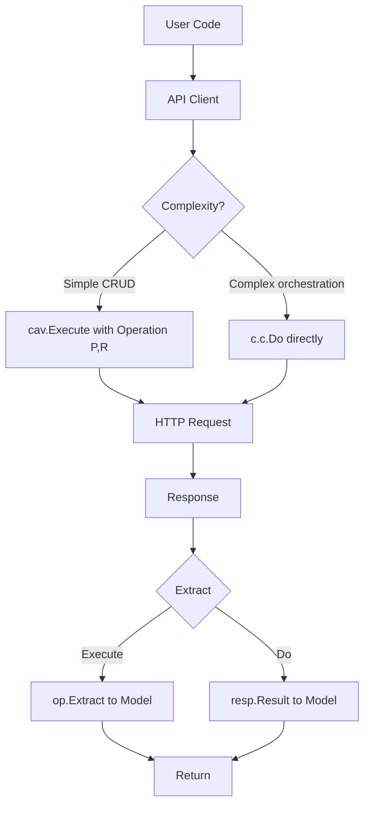
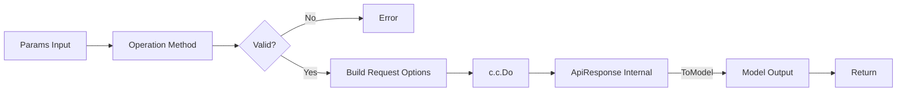

# CloudAvenue SDK V2 Architecture

## Overview

The SDK follows a layered architecture where typed operations are expressed as Go methods on per-group clients, with two implementation strategies depending on complexity.

## Repository Layout

```
cloudavenue-sdk-go-v2/
├── cav/                    # Core SDK: Client, Endpoint registry, Operation[P,R], auth
├── api/<group>/v1/         # Public API surface: Client + typed operations
├── endpoints/zz_*.go       # Generated endpoint accessor wrappers
├── internal/iendpoints/    # Endpoint definitions (init-registered, validated)
├── internal/itypes/        # Internal request/response types (ApiRequest*, ApiResponse*)
├── types/                  # Public models and params (Model*, Params*)
├── pkg/                    # Shared utilities (consoles, errors)
├── cmd/
│   └── endpoint-generator/ # Generates endpoints/zz_*.go from internal/iendpoints/
```

## Layer Responsibilities

### `cav/` — Core Runtime

- `Client` interface: entrypoint (`NewClient`), handles auth, session lifecycle, sub-client routing.
- `Endpoint`: typed struct defining method, path, params, validators, body types, backend target.
- `Endpoint` registry: global `init()` registration in `internal/iendpoints/`, accessed via `MustGetEndpoint(name)`.
- `Operation[P,R]`: compile-time typed operation definition with `Validate`, `Transform`, `Extract`.
- `Execute`: validates, transforms body, applies options, performs request, extracts typed result.
- `Do` / `NewRequest`: lower-level request execution used by complex operations.

### `internal/iendpoints/` — Endpoint Definitions

Each file declares endpoints via `init()` registration:

```go
func init() {
    cav.Endpoint{
        Name:             "GetEdgeGateway",
        Description:      "Get EdgeGateway",
        Method:           cav.MethodGET,
        Backend:          cav.BackendVMware,
        PathTemplate:     "/cloudapi/1.0.0/edgeGateways/{edgeId}",
        PathParams:       []cav.PathParam{{Name: "edgeId", Required: true, ...}},
        ResponseType:     itypes.ApiResponseEdgegateway{},
    }.Register()
}
```

`endpoints/zz_*.go` are thin generated accessors (`GetEdgeGateway() *cav.Endpoint`) over these definitions.

### `api/<group>/v1/` — Public Operations

Each package exposes:

- `client.go` — `Client` struct embedding `cav.Client`, constructor `New(cav.Client)`.
- `<group>_commands.go` — all operations for the group.

Operations follow naming conventions (`Get`, `List`, `Create`, `Update`, `Delete`, `Enable`, `Disable`, `Add`, `Remove`).

Two implementation patterns:

**Typed delegation** (simple CRUD):

```go
func (c *Client) GetEdgeGateway(ctx context.Context, params types.ParamsEdgeGateway) (*types.ModelEdgeGateway, error) {
    ep := endpoints.GetEdgeGateway()
    // validate, resolve, ...
    resp, err := c.c.Do(ctx, ep, cav.WithPathParam(...))
    return resp.Result().(*itypes.ApiResponseEdgegateway).ToModel(), nil
}
```

**Direct orchestration** (complex multi-step):

```go
func (c *Client) CreateEdgeGateway(ctx context.Context, params types.ParamsCreateEdgeGateway) (*types.ModelEdgeGateway, error) {
    // Parallel errgroup, custom body transforms, job extraction, etc.
    _, err := c.c.Do(ctx, ep, cav.SetBody(reqBody), cav.WithJobExtractor(...))
}
```

### `types/` and `internal/itypes/` — Type Split

- `types/` — Public-facing `Params*` (input) and `Model*` (output). Safe to expose to SDK users.
- `internal/itypes/` — Internal `ApiRequest*` and `ApiResponse*`. Match raw API payloads; converted to/from `types/` via `.ToModel()` / `.FromParams()`.

### `cmd/` — Code Generation

- `endpoint-generator` — reads `internal/iendpoints/*.go`, emits `endpoints/zz_*.go`.

## Data Flow



## Type Lifecycle



## Conventions

Naming conventions, lint rules, and coding standards are documented in [GUIDELINES.md](./GUIDELINES.md).

## Design Decisions

- **Hybrid operation model**: `Operation[P,R]` + `cav.Execute` for simple, type-safe operations; `c.c.Do` for complex orchestration (parallel requests, custom transforms, job polling). `Operation[P,R]` provides `Validate`, `Transform`, and `Extract` hooks. Avoids forcing every method into a rigid generic container.
- **Generated accessors, hand-written operations**: Endpoints are generated for discoverability; operations are hand-written because business logic (validation, resolution, orchestration) cannot be meaningfully generated.
- **No command registry**: Removed `commands/` package dependency from `api/`. Runtime dispatch now stays in typed `api/` methods plus `cav.Execute`; `cmd/endpoint-generator` remains for endpoint accessor generation.
