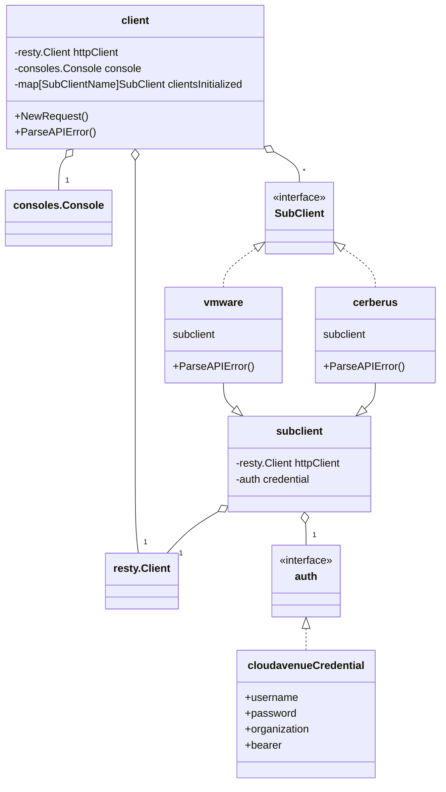

# Contributing to CloudAvenue SDK V2

Thank you for your interest in contributing to this project! Please read the following guidelines carefully before submitting your contribution.

---

## 1. Prerequisites

- **Go Version**: This project requires **Go 1.24** or higher.  
  Check your version with:

  ```sh
  go version
  ```

- Install dependencies with:

  ```sh
  go mod tidy
  ```

---

## 2. Project Architecture

The project is organized into several main directories:

- **`cav/`**  
  Contains the core SDK logic: main client management, authentication, sub-clients (Vmware, Cerberus, S3, etc.), endpoint management, and more.

- **`api/`**  
  Contains CloudAvenue API implementations, organized by functional domain (e.g., `org/v1/`, etc).  
  Each subdirectory exposes high-level methods to interact with the various services.

> More detailed sections about the `cav` and `api` architecture will be provided later in this document.

---

## 2.1 The `cav` Client

The `cav` package is the core entry point of the SDK. It is responsible for:

- Managing authentication and configuration for CloudAvenue services.
- Providing a unified client (`client`) that exposes access to various sub-clients (e.g., VMware, Cerberus, Netbackup).
- Handling endpoint discovery and service routing.
- Managing session lifecycle and credentials.

#### General Workflow

1. **Initialization**:  
   The user creates a new `client` by providing credentials and configuration options.

2. **Authentication**:  
   The client authenticates with CloudAvenue and manages tokens or session information.

3. **Sub-client Access**:  
   The `client` exposes sub-clients for specific services (e.g., VMware, Cerberus, Netbackup). Each sub-client is initialized with the necessary context and endpoints.

4. **Service Operations**:  
   Users interact with the sub-clients to perform operations on CloudAvenue resources.

#### Mermaid Diagram



This diagram reflects the actual dependencies and composition in the [`cav`](cav) package:  

- The main `client` holds a `resty.Client`, a `consoles.Console`, and a map of initialized sub-clients.
- Each sub-client embeds a `subclient` struct, which itself holds a `resty.Client` and an `auth` credential.
- The `auth` interface is implemented by `cloudavenueCredential`.

## 2.2 The `api` Directory

The `api/` directory contains all the APIs consumed by the SDK, organized by major object groups and by version.

- **Object Groups:**  
  Each subdirectory under `api/` represents a major CloudAvenue object or resource type, such as `edgegateway`, `vdc`, `vapp`, etc.  
  This structure helps keep the codebase modular and easy to navigate.

- **Versioning:**  
  Inside each object group, APIs are further organized by version (e.g., `v1`, `v2`, etc).  
  **Important:** These versions do **not** directly reflect the upstream API versions.  
  Instead, they are used internally to allow the SDK to implement new versions when there are significant changes in the API, making it easier to manage breaking changes and maintain backward compatibility.

### Example Structure

```
api/
  edgegateway/
    v1/
      edgegateway.go
    v2/
      edgegateway.go
  vdc/
    v1/
      vdc.go
  vapp/
    v1/
      vapp.go
```

This approach allows the SDK to evolve and support multiple API versions for each object group, ensuring stability for users even as the underlying APIs change.

## 3. Contribution Best Practices

- **Commit Convention**:  
  Use the [Conventional Commits](https://www.conventionalcommits.org/en/v1.0.0/) format for your commit messages (e.g., `feat: add multi-tenant support`, `fix: authentication bug fix`).

- **Unit Tests**:  
  Every new feature or bug fix must be covered by unit tests.  
  Run tests with:

  ```sh
  go test ./...
  ```

- **Linting**:  
  The project uses [golangci-lint](https://golangci-lint.run/).  
  Check linting before submitting a PR:

  ```sh
  golangci-lint run
  ```

- **Respect GitHub Workflows**:  
  PRs are automatically validated (lint, tests, license, etc).  
  Make sure all checks pass before requesting a review.

- **Documentation**:  
  Document your public functions and add usage examples if necessary.

---

## 4. Lint Rules and Naming Conventions

To maintain code quality and consistency, the following lint rules are enforced in this project.  
These rules are checked automatically by custom linters and ruleguard scripts.

### API Type Naming

- **API Response Types:**  
  Must be named `apiResponse<Object>` (e.g., `apiResponseEdgeGateway`).
- **API Request Body Types:**  
  Must be named `apiRequest<Object>` (e.g., `apiRequestEdgeGateway`).
- **User-facing Model Types:**  
  Must be named `Model<Object>` (e.g., `ModelEdgeGateway`).
- **User-supplied Parameter Types:**  
  Must be named `Params<Object>` (e.g., `ParamsEdgeGateway`).
- **Client Types:**  
  Must be named `Client` (exactly, for the main client struct of an API group).

You can visualize and debug the naming convention regex used by the linter here: [https://regex101.com/r/g8Av6t/1](https://regex101.com/r/g8Av6t/1)

### API Function Naming

- Exported functions in any `api/` directory must start with one of the following prefixes:  
  `Get`, `Create`, `List`, `Delete`, `Update`, `Enable`, `Disable`
  - Example: `GetEdgeGateway`, `CreateVDC`, `ListVApps`
- Functions returning a boolean value must start with:  
  `Is`, `is`, `Has`, `has`, `Match`, `match`
  - Example: `IsEnabled`, `HasPermission`, `matchURN`

### ToModel Method Rule

- Exported `ToModel` methods are **not allowed** on types named `apiResponse*` or `apiRequest*` in any `api/` directory.
- Use a private `toModel` method instead to avoid exposing internal conversion logic.

---

Thank you for following these guidelines to help ensure the quality and maintainability of the CloudAvenue SDK. We appreciate your contributions!
